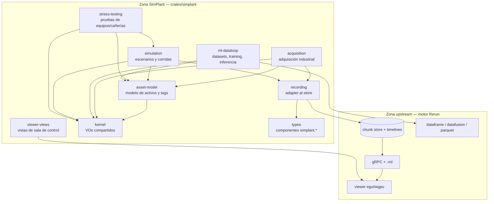
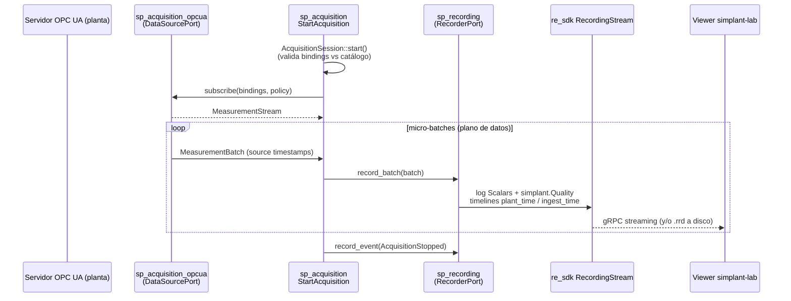
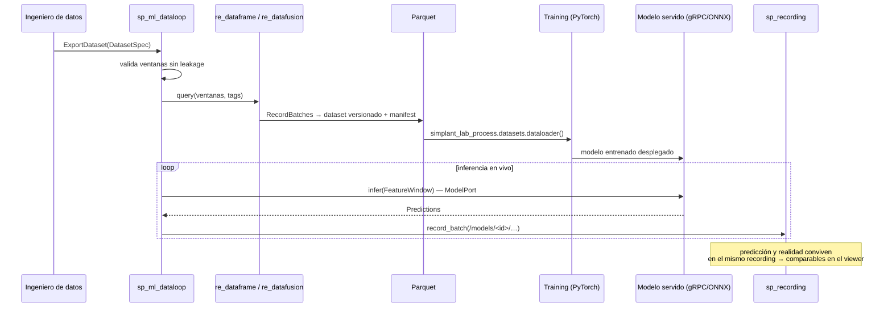

# Plan de migración — de Rerun a SimPlant lab

| Campo | Valor |
|---|---|
| **Estado** | Propuesta v2 — para revisión (v2 amplía la estrategia de simulación: secciones 4.11, 7 y 8.1) |
| **Fecha** | 2026-06-12 |
| **Base upstream** | Rerun `0.33.0-alpha.1+dev` (fork en `github.com/SimPlant/SimPlant-v2`) |
| **Alcance** | Rebranding, dominio Oil & Gas, adquisición industrial, bucle de datos IA, simulación y stress testing |
| **Documentos relacionados** | [`GUIDELINES.md`](GUIDELINES.md) — objetivos del producto · [`implementation-notes.md`](../../implementation-notes.md) — rebranding en curso |

---

## 1. Resumen ejecutivo

SimPlant Lab es la capa de datos para IA de la industria Oil & Gas: primitivas para construir, comprender y mejorar bucles de datos multimodales y de múltiples velocidades, desde la primera grabación hasta escala masiva, habilitando entrenamiento e inferencia en tiempo real, simulación de procesos y stress tests de equipos y cañerías.

La estrategia de migración se resume en una frase:

> **Rerun se conserva intacto como motor genérico de datos multimodales; todo lo específico de Oil & Gas vive en módulos nuevos (`crates/simplant/*`) organizados con arquitectura hexagonal y el patrón Aggregate, conectados al motor exclusivamente a través de sus puntos de extensión oficiales** (importers, lenses, componentes propios, vistas custom del viewer).

Esto tiene tres consecuencias deliberadas:

1. **Diff mínimo contra upstream** — Rerun publica mejoras de rendimiento y formato continuamente; mantener los crates `re_*` casi intactos hace viable mergear upstream periódicamente.
2. **Dominio puro y testeable** — el modelo de proceso (tags, equipos, envolventes operativas) no depende de ningún crate `re_*`; se testea sin infraestructura.
3. **Modularidad verificable** — cada capacidad (adquisición, ML, simulación, stress testing) se puede eliminar sin romper las demás. Si borrar un módulo rompe algo no relacionado, el acoplamiento es excesivo y se corrige.

---

## 2. Contexto

### 2.1 qué heredamos de Rerun

El fork parte de Rerun 0.33, que ya resuelve los problemas más caros de construir desde cero:

| Capacidad heredada | Crates | Relevancia para Oil & Gas |
|---|---|---|
| Store columnar indexado por tiempo (Arrow) | `re_chunk`, `re_chunk_store`, `re_entity_db` | Telemetría multi-velocidad: vibración a kHz y temperaturas a 1/min en el mismo store |
| Múltiples líneas de tiempo por dato | `re_log_types` (timelines) | Tiempo de planta vs tiempo de ingesta vs tiempo de simulación |
| Transporte y grabación | `re_grpc_server`, `re_grpc_client`, `re_log_encoding` (`.rrd`) | Streaming en vivo + archivo histórico con el mismo pipeline |
| API de dataframes y SQL | `re_dataframe`, `re_datafusion`, `re_sorbet` | Extracción de datasets de entrenamiento |
| Export/import Parquet | `re_parquet` | Interoperabilidad con el ecosistema de datos (Spark, Polars, PyTorch) |
| Importers extensibles | `re_importer` (trait `Importer` + `BUILTIN_IMPORTERS`) | Ya se agregó `DxfImporter` para planos CAD — patrón validado |
| Lenses (transformaciones Arrow componibles) | `re_lenses`, `re_lenses_core` | Mapear payloads foráneos (Sparkplug B, CDR) a tipos del store sin tocar el core |
| Viewer extensible | `re_viewer` (`add_view_class`), `re_view_*` | Tendencias, timeline de estados, grafos, 3D, mapas — base de la sala de control |
| SDKs multi-lenguaje | `re_sdk`, `rerun_py` (→ `simplant_lab`), `rerun_c`/C++ | Python es el lenguaje del equipo de datos/ML del cliente |
| Servidor OSS y protocolo de catálogo | `re_server`, `re_redap_client`, `re_protos` | Camino a "escala masiva" (catálogo de grabaciones) |
| Robustez operativa | `re_backoff` (reconexión), `re_quota_channel` (backpressure), `re_memory`, `re_crash_handler` | Adquisición 24/7 en planta |

### 2.2 la brecha para oil & gas

Lo que Rerun **no** trae y SimPlant Lab debe construir:

1. **Modelo de dominio de proceso**: tags ISA-5.1, jerarquía de activos (planta → área → unidad → equipo), unidades de ingeniería, calidad de señal (Good/Bad/Uncertain), límites de alarma, envolventes operativas, specs de diseño de equipos y cañerías.
2. **Conectividad industrial**: OPC UA, Modbus TCP/RTU, MQTT (Sparkplug B), replay de historiadores (CSV/Parquet, PI Web API).
3. **Bucle de datos IA**: datasets versionados y reproducibles, dataloaders para PyTorch, registro de predicciones junto a los datos reales para comparación.
4. **Simulación de procesos**: flowsheets propios versionables, termodinámica, motores de resolución (externo primero, nativo incremental), campañas de muestreo masivas y comparación sim vs planta. La visión de producto es que el ingeniero de procesos haga **todo** en SimPlant Lab, reemplazando la experiencia DWSIM/HYSYS — estrategia completa en 4.11.
5. **Stress testing**: definición de perfiles de carga sobre equipos/cañerías, ejecución sobre el simulador, evaluación contra criterios de aceptación.
6. **Distribución industrial**: sin telemetría saliente, operación air-gapped, branding propio.

### 2.3 estado actual del fork (Fase 0, en curso)

El working tree contiene un rebranding avanzado y documentado en [`implementation-notes.md`](../../implementation-notes.md). Decisiones ya tomadas que este plan **respeta**:

- `crates/top/rerun` → `crates/top/simplant-lab`; `rerun-cli` → `simplant-lab-cli`; binario `simplant-lab`.
- Branding centralizado en `crates/viewer/re_ui/src/branding.rs` (`PRODUCT_NAME`, `PRODUCT_NAME_LOWERCASE`) — un solo lugar para cambiar la marca.
- Python: módulo `rerun` renombrado a `simplant_lab` con paquete shim `rerun` que re-exporta con `DeprecationWarning`; wheel `simplant-lab-sdk`; módulo PyO3 `rerun_bindings` sin renombrar.
- FlatBuffers `namespace rerun` **sin cambiar** (compatibilidad de wire format y API) — ídem namespace C++ `rerun::`.
- `re_sdk::spawn` busca el binario `simplant-lab`.
- `pixi.toml` con tareas `simplant-lab*` y aliases `rerun*` de compatibilidad.
- Primer importer Oil & Gas: `DxfImporter` en `re_importer` (dep `dxf = "0.6"`), para planos CAD.

---

## 3. Principios rectores

### P1 — fork mínimamente invasivo

El repo queda dividido en dos zonas con reglas distintas:

| Zona | Contenido | Regla |
|---|---|---|
| **Zona upstream** | `crates/{store,viewer,utils,build}/*`, `rerun_py/src`, `rerun_cpp`, `docs/snippets` | Solo se toca para: (a) branding vía `re_ui::branding`, (b) registrar extensiones en puntos oficiales (p. ej. `BUILTIN_IMPORTERS`), (c) bugfixes que se intentan upstreamear. Todo diff se anota en `docs/proyect/UPSTREAM_DIFF.md`. |
| **Zona SimPlant** | `crates/simplant/*`, `crates/top/simplant-lab*`, `python/simplant_lab_process`, `docs/proyect` | Propiedad total, evoluciona libre. |

**Heurística**: antes de editar un archivo de la zona upstream, preguntarse si lo mismo se logra con un crate nuevo + punto de extensión. Casi siempre la respuesta es sí.

### P2 — la estructura refleja el problema, no la tecnología

Los módulos nuevos se nombran por capacidad del dominio (`asset-model`, `acquisition`, `ml-dataloop`, `simulation`, `stress-testing`), no por capa técnica. La prueba: si se borra `crates/simplant/sp_simulation`, se pierde simulación — adquisición, ML y el viewer siguen funcionando.

### P3 — hexagonal + aggregates

Cada capacidad se estructura en capas con **regla de dependencia estricta hacia adentro**:

```
Presentación (CLI, vistas del viewer)
    ↓ depende de
Aplicación (casos de uso, puertos)
    ↓ depende de
Dominio (aggregates, value objects, eventos — Rust puro, CERO deps re_*)
    ↑ implementan los puertos
Infraestructura (adapters: OPC UA, Modbus, RecordingStream, Parquet, gRPC)
```

- El **dominio** no conoce a Rerun, a Tokio ni a Arrow. Es Rust puro + `uom` + `thiserror`.
- La **aplicación** define puertos (traits) y orquesta aggregates. Conoce el dominio, no los adapters.
- La **infraestructura** implementa puertos sobre crates `re_*` y drivers industriales.
- La **presentación** son adapters de entrada: subcomandos CLI y vistas del viewer.

Los **aggregates** son los límites de consistencia: toda mutación entra por la raíz, que protege sus invariantes. Entre aggregates solo hay referencias por ID, nunca por objeto.

### P4 — plano de control ≠ plano de datos

Distinción central para que DDD no destruya el rendimiento:

- **Plano de datos** (alta frecuencia): mediciones, espectros de vibración, frames. **No son eventos de dominio.** Fluyen como streams columnar por `re_chunk` con micro-batching. Modelar cada medición como evento a 1 kHz es inviable.
- **Plano de control** (baja frecuencia): `TagDefined`, `AcquisitionStarted`, `ScenarioApproved`, `StressTestCompleted`. Estos sí son eventos de dominio, con aggregates e invariantes.

---

## 4. Diseño técnico

### 4.1 mapa de capacidades



Flechas = dependencia permitida. No existe ninguna flecha desde la zona upstream hacia la zona SimPlant, con dos excepciones controladas: el registro del `DxfImporter` en `re_importer` (ya hecho) y el registro de vistas custom en el arranque del viewer (sección 4.8).

### 4.2 estructura del workspace

Crates nuevos bajo `crates/simplant/`, con prefijo `sp_` (análogo al `re_` de Rerun):

```
crates/simplant/
├── sp_kernel/              # Shared kernel: TagId, UnitOfMeasure, Quality, TimeWindow,
│                           # Measurement, MeasurementBatch. Sin deps re_*. Sin I/O.
├── sp_types/               # Componentes/archetypes "simplant.*" para el store
│                           # (anti-corruption layer hacia re_types_core). Etapas en 4.7.
├── sp_asset_model/         # Capacidad: modelo de planta (aggregates Facility/Equipment/Tag)
├── sp_acquisition/         # Capacidad: adquisición (dominio + aplicación + puertos)
├── sp_acquisition_opcua/   # Adapter: driver OPC UA            (dep: opcua)
├── sp_acquisition_modbus/  # Adapter: driver Modbus TCP/RTU    (dep: tokio-modbus)
├── sp_acquisition_mqtt/    # Adapter: driver MQTT + Sparkplug B (dep: rumqttc + prost)
├── sp_acquisition_replay/  # Adapter: replay CSV/Parquet de historiadores
├── sp_recording/           # Adapter compartido: RecorderPort → re_sdk::RecordingStream
├── sp_ml_dataloop/         # Capacidad: datasets, export, registro de predicciones
├── sp_simulation/          # Capacidad: flowsheets, escenarios, corridas y campañas
├── sp_thermo/              # Capacidad: propiedades termodinámicas (PropertyPackagePort)
├── sp_sim_engine/          # Adapter: motor de resolución nativo (steady-state + dinámico)
├── sp_simulation_dwsim/    # Adapter: cliente gRPC + supervisor del sidecar DWSIM
├── sp_stress_testing/      # Capacidad: stress tests de equipos y cañerías
└── sp_viewer_views/        # Presentación: vistas custom del viewer
bridges/
└── dwsim-bridge/           # Sidecar C#/.NET (GPLv3, ver 8.1) que envuelve DWSIM.Automation
python/
└── simplant_lab_process/   # Toolkit Python: catálogo de tags, datasets, dataloaders, RL env
```

Criterio para separar crates: los **drivers con dependencias pesadas** (OPC UA, Modbus, MQTT) van en crates propios para que el acoplamiento sea explícito en `Cargo.toml`, el grafo de dependencias sea verificable por el compilador y los tiempos de build no se degraden. Las capas domain/application/infrastructure ligeras conviven como módulos dentro del crate de cada capacidad.

### 4.3 anatomía de un módulo

Ejemplo con `sp_acquisition` (el patrón se repite en cada capacidad):

```
sp_acquisition/src/
├── domain/                       # CERO deps re_*; testeable en aislamiento
│   ├── session.rs                #   Aggregate AcquisitionSession
│   ├── binding.rs                #   VO TagBinding (TagId ↔ dirección física)
│   ├── sampling.rs               #   VO SamplingPolicy (rate, deadband)
│   └── events.rs                 #   AcquisitionStarted/Stopped/SourceLost
├── application/
│   ├── ports.rs                  #   DataSourcePort, RecorderPort, AssetCatalogPort
│   ├── start_acquisition.rs      #   Caso de uso
│   └── stop_acquisition.rs       #   Caso de uso
├── infrastructure/
│   └── config.rs                 #   Carga de perfiles TOML (driven adapter local)
├── api.rs                        # Contrato público del módulo (lo único re-exportado)
└── lib.rs
```

Los drivers concretos (`sp_acquisition_opcua`, etc.) implementan `DataSourcePort` desde afuera: son la infraestructura del módulo viviendo en crates separados.

### 4.4 el dominio: aggregates

| Aggregate (raíz) | Módulo | Invariantes que protege | Eventos de dominio |
|---|---|---|---|
| `Facility` | `sp_asset_model` | Códigos de área/unidad únicos dentro de la planta; jerarquía acíclica | `FacilityDefined`, `UnitAdded` |
| `Equipment` | `sp_asset_model` | Specs de diseño coherentes (presión/temperatura máx > operativas); referencia a unidad existente por ID | `EquipmentCommissioned`, `DesignSpecRevised` |
| `Tag` | `sp_asset_model` | Unidad de ingeniería válida; rango EU coherente (`low < high`); límites de alarma ordenados (`LL ≤ L < H ≤ HH`) dentro del rango | `TagDefined`, `AlarmLimitsChanged` |
| `AcquisitionSession` | `sp_acquisition` | Solo se bindean tags existentes en el catálogo; no hay dos bindings al mismo tag; transiciones de estado válidas (Created → Running → Stopped) | `AcquisitionStarted`, `SourceLost`, `AcquisitionStopped` |
| `DatasetSpec` | `sp_ml_dataloop` | Ventanas de train/val/test sin solapamiento temporal (previene leakage); features referencian tags existentes; versión de schema inmutable tras publicación | `DatasetPublished` |
| `FlowsheetSpec` | `sp_simulation` | Grados de libertad cuadrados (variables = ecuaciones) antes de aprobar; grafo de unit ops/corrientes bien formado; composiciones que suman 1; unidades coherentes; paquete termodinámico declarado | `FlowsheetApproved`, `FlowsheetRevised` |
| `Scenario` | `sp_simulation` | Referencia un `FlowsheetSpec` aprobado; condiciones de borde completas para los tags de entrada; duración > 0; compatible con la capability del motor (steady-state vs dinámico) | `ScenarioApproved` |
| `SimulationRun` | `sp_simulation` | Solo corre escenarios aprobados; vincula 1:1 con un `RecordingId` | `RunCompleted`, `RunFailed` |
| `SamplingCampaign` | `sp_simulation` | Rangos de muestreo dentro de envolventes operativas; diseño de muestreo válido (LHS/Sobol) con semilla registrada; presupuesto de corridas acotado | `CampaignCompleted` |
| `StressTest` | `sp_stress_testing` | Perfil de carga dentro de límites de diseño × factor de seguridad configurado; criterios de aceptación no vacíos | `StressTestPlanned`, `StressTestCompleted` |

Esbozo ilustrativo del aggregate `Tag` (el código real se escribe en Fase 1):

```rust
// sp_asset_model/src/domain/tag.rs — dominio puro, sin deps re_*
pub struct Tag {
    id: TagId,                    // VO: nomenclatura ISA-5.1, p. ej. "PT-1101A"
    equipment: EquipmentId,       // referencia por ID a otro aggregate
    unit: UnitOfMeasure,          // VO sobre `uom`: kPa, °C, m³/h, bbl/d…
    range: EngineeringRange,      // VO: low < high, en `unit`
    alarms: Option<AlarmLimits>,  // VO: LL ≤ L < H ≤ HH dentro de `range`
}

impl Tag {
    /// Único constructor: imposible crear un Tag que viole invariantes.
    pub fn define(spec: TagSpec) -> Result<(Self, TagDefined), TagError> { /* … */ }

    pub fn change_alarm_limits(
        &mut self,
        limits: AlarmLimits,
    ) -> Result<AlarmLimitsChanged, TagError> { /* revalida contra range */ }
}
```

### 4.5 puertos (contratos entre capas)

| Puerto | Tipo | Definido en | Operaciones | Adapters |
|---|---|---|---|---|
| `DataSourcePort` | driven | `sp_acquisition` | `subscribe(bindings, policy) → MeasurementStream` — **deliberadamente sin escritura** (sección 8.4) | `sp_acquisition_{opcua,modbus,mqtt,replay}` |
| `RecorderPort` | driven | `sp_acquisition` (reusado por simulation/ml) | `record_batch(MeasurementBatch)`, `record_static(AssetSnapshot)`, `record_event(DomainEvent)` | `sp_recording` (→ `re_sdk::RecordingStream`) |
| `AssetCatalogPort` | driven | `sp_asset_model` | `load_catalog() → Facility + Tags`, `save_catalog(…)` | TOML/JSON versionado en git (fuente de verdad declarativa) |
| `DataframeQueryPort` | driven | `sp_ml_dataloop` | `query(TimeWindow, tags) → RecordBatchStream` | sobre `re_dataframe`/`re_datafusion` |
| `DatasetSinkPort` | driven | `sp_ml_dataloop` | `write(RecordBatchStream, DatasetManifest)` | Parquet vía `re_parquet`/`parquet` |
| `ModelPort` | driven | `sp_ml_dataloop` | `infer(FeatureWindow) → Predictions` | gRPC (`tonic`) a serving externo; ONNX embebido (`ort`, opcional) |
| `SimulatorPort` | driven | `sp_simulation` | `capabilities() → {steady_state, dynamic}`, `initialize(Scenario)`, `step(dt) → SimState`, `finalize()` — `step` es además la firma natural de un env de RL | `sp_sim_engine` (motor nativo); `sp_simulation_dwsim` (gRPC al sidecar DWSIM, cuasi-estático) |
| `PropertyPackagePort` | driven | `sp_thermo` | `flash(T, P, z)`, `enthalpy(…)`, `density(…)`, `k_values(…)` | `feos` (PR/SRK/PC-SAFT en Rust); CoolProp vía FFI (puros); CAPE-OPEN (futuro: paquetes comerciales que el cliente ya licencia) |
| CLI / vistas | driving | `simplant-lab-cli`, `sp_viewer_views` | invocan casos de uso de aplicación | — |

Esbozo de los dos puertos centrales:

```rust
// sp_acquisition/src/application/ports.rs
#[async_trait]
pub trait DataSourcePort: Send + Sync {
    async fn subscribe(
        &self,
        bindings: &[TagBinding],
        policy: &SamplingPolicy,
    ) -> Result<MeasurementStream, AcquisitionError>;
}

pub trait RecorderPort: Send + Sync {
    fn record_batch(&self, batch: MeasurementBatch) -> Result<(), RecordingError>;
    fn record_static(&self, snapshot: &AssetSnapshot) -> Result<(), RecordingError>;
    fn record_event(&self, event: &ControlPlaneEvent) -> Result<(), RecordingError>;
}
```

`sp_recording` es el **único** lugar del sistema que traduce dominio → primitivas del store. Si mañana cambia la API de `re_sdk`, el cambio queda contenido en un crate.

### 4.6 mapeo dominio → primitivas del store

| Concepto de dominio | Primitiva Rerun | Convención |
|---|---|---|
| Jerarquía de activos | `EntityPath` | `/site/<área>/<unidad>/<equipo>/<tag>` — p. ej. `/site/topping/t-101/p-1101a/pt-1101a` |
| Medición (valor + calidad) | `Scalars` + componente `simplant.Quality` | una entidad por tag; calidad como componente paralelo |
| Metadata de tag (unidad, rango, límites) | datos **static** sobre la entidad del tag | se loguea una vez al iniciar la grabación, desde el catálogo |
| Estado de alarma | componente `simplant.AlarmState` | visualizable con `re_view_state_timeline` |
| Specs de equipo | static `simplant.EquipmentSpec` | base para overlays de envolvente |
| Planos / layout 3D | `DxfImporter` + `re_view_spatial` | ya operativo para DXF |
| Topología de proceso (PFD) | grafo (`GraphNodes`/`GraphEdges`) | visualizable con `re_view_graph` |
| Tiempo del sensor | timeline `plant_time` (timestamp UTC del **source timestamp** OPC UA) | timeline principal |
| Tiempo de recepción | timeline `ingest_time` | diagnóstico de latencia/clock skew |
| Paso de simulación | timeline `sim_time` (+ `plant_time` si el escenario replica un período real) | permite comparar sim vs real alineando `plant_time` |
| Corrida (sim, test, turno, batch) | un `Recording` por corrida; propiedades del recording llevan `scenario_id`/`test_id` | unidad de retención y catálogo |
| Campaña de muestreo | N recordings + manifest de campaña (`campaign_id`, diseño, semilla) | insumo directo de `DatasetSpec` para entrenar surrogates |
| Predicciones de modelos | entidades bajo `/models/<modelo>/<tag>` en el mismo recording | comparación predicción vs real en la misma vista |

### 4.7 tipos SimPlant: estrategia en dos etapas

**Etapa A (Fases 1–3) — componentes manuales, cero diff upstream.** `sp_types` define componentes con `re_types_core::ComponentDescriptor` bajo namespace `simplant.*` e implementa `AsComponents` para los "archetypes" propios (`ProcessVariable`, `AlarmEvent`, `EquipmentSpec`). En Python se loguean con `AnyValues`/batches custom. Ventaja: no se toca el codegen ni los `.fbs`. Costo: boilerplate manual y sin bindings C++ generados.

**Etapa B (Fase 5+, si se justifica) — codegen propio.** Definiciones `.fbs` en `crates/store/re_sdk_types/definitions/simplant/` y extensión mínima de `re_types_builder` para el namespace adicional. Se gana generación Rust/Python/C++ y docs automáticas; se paga un diff upstream acotado y permanente. **Decisión diferida**: solo si la superficie de tipos crece o aparece demanda C++.

El `namespace rerun` de los `.fbs` existentes **no se toca** (decisión de Fase 0: compatibilidad de wire format).

### 4.8 presentación

**Vistas existentes que se reutilizan tal cual** (configuradas vía blueprint):

| Vista | Uso en SimPlant Lab |
|---|---|
| `re_view_time_series` | Tendencias de variables de proceso (la vista principal de la sala de control) |
| `re_view_state_timeline` | Estados de alarma, modos de operación, estados de máquina |
| `re_view_graph` | Topología de proceso (PFD), trazabilidad de flujos |
| `re_view_spatial` (2D/3D) | Planos DXF, modelos 3D de planta, nubes de puntos de inspección |
| `re_view_dataframe` | Inspección tabular, validación de datasets |
| `re_view_map` | Activos georreferenciados (pozos, ductos, baterías) |
| `re_view_tensor` / `bar_chart` / `text_log` | Espectros de vibración, histogramas, logs de eventos |

**Vistas custom** (`sp_viewer_views`, registradas con `app.add_view_class::<…>()` — mismo mecanismo que `examples/rust/custom_view`):

1. **Panel de alarmas**: lista priorizada de alarmas activas/históricas con acknowledge visual (solo lectura de datos).
2. **Envolvente operativa**: PV contra su `OperatingEnvelope` y límites de diseño, con bandas coloreadas.
3. **Editor de flowsheet** *(F7)*: grafo editable de unit operations/corrientes que lee y escribe el `FlowsheetSpec` (TOML) y lo ejecuta vía `SimulatorPort` — la pieza central de la experiencia "solo SimPlant Lab" (4.11).
4. *(Futuro)* **P&ID interactivo**: DXF como fondo + tags vivos superpuestos; con DEXPI, topología semántica incluida (4.11).

**Blueprints como producto**: plantillas predefinidas ("Sala de control", "Análisis de corrida", "Sim vs Real") versionadas como `.rbl` en `crates/simplant/sp_viewer_views/blueprints/`.

**CLI** (subcomandos nuevos en `simplant-lab`, delegando en casos de uso de aplicación):

```
simplant-lab acquire --config planta.toml      # inicia AcquisitionSession
simplant-lab assets validate catalogo/         # valida invariantes del catálogo
simplant-lab dataset export --spec ds.toml     # DatasetSpec → Parquet
simplant-lab flowsheet validate fs.toml        # valida DOF y consistencia del FlowsheetSpec
simplant-lab sim run --scenario esc.toml       # corre escenario contra SimulatorPort
simplant-lab sim campaign --spec camp.toml     # campaña de muestreo (insumo de surrogates)
simplant-lab stress run --test prueba.toml     # ejecuta stress test
```

### 4.9 flujos end-to-end

**Adquisición → visualización en vivo:**



**Bucle de datos IA:**



### 4.10 grafo de dependencias entre crates

```mermaid
graph LR
    subgraph dominio_puro
        K[sp_kernel]
        AM[sp_asset_model]
        ACQ[sp_acquisition]
        ML[sp_ml_dataloop]
        SIM[sp_simulation]
        ST[sp_stress_testing]
    end
    subgraph adapters
        OPC[sp_acquisition_opcua]
        MOD[sp_acquisition_modbus]
        MQ[sp_acquisition_mqtt]
        RPL[sp_acquisition_replay]
        REC[sp_recording]
        TY[sp_types]
        VV[sp_viewer_views]
        ENG[sp_sim_engine]
        DW[sp_simulation_dwsim]
        TH[sp_thermo]
    end
    AM --> K
    ACQ --> AM
    ML --> AM
    SIM --> AM
    ST --> SIM
    OPC --> ACQ
    MOD --> ACQ
    MQ --> ACQ
    RPL --> ACQ
    REC --> ACQ
    REC --> TY
    ENG --> SIM
    ENG --> TH
    DW --> SIM
    DW -.->|gRPC| BR[bridges/dwsim-bridge C# GPLv3]
    TY -.-> RE1[re_types_core]
    REC -.-> RE2[re_sdk]
    ML -.-> RE3[re_dataframe / re_parquet]
    VV -.-> RE4[re_viewer / re_view]
    CLI[simplant-lab-cli] --> OPC & MOD & MQ & RPL & REC & VV & ML & SIM & ST & ENG & DW
```



**Regla verificable por el compilador**: los crates de `dominio_puro` no declaran ninguna dependencia `re_*` en su `Cargo.toml`. Solo los adapters (línea punteada) tocan el motor. `simplant-lab-cli` es el composition root: el único lugar donde se cablean adapters con casos de uso.

### 4.11 estrategia de simulación de procesos

**Visión de producto**: el ingeniero de procesos hace **todo** en SimPlant Lab — define flowsheets, corre simulaciones, analiza resultados, entrena modelos. Se reemplaza la **experiencia** DWSIM/HYSYS desde el primer release con simulación; el **motor** de física se reemplaza por etapas. El "mejorado" del producto no es mejor termodinámica que HYSYS: es que **cada simulación alimenta modelos de IA y cada modelo mejora la simulación**. HYSYS corre y descarta; SimPlant Lab corre y aprende.

#### Pieza 1 — el flowsheet es nuestro (`FlowsheetSpec`)

El modelo de simulación se adueña: aggregate `FlowsheetSpec` con unit operations tipadas, corrientes de materia/energía, especificaciones, componentes químicos y paquete termodinámico. Invariantes en construcción, no en runtime:

- **Análisis de grados de libertad**: el flowsheet no se aprueba si variables ≠ ecuaciones (HYSYS deja descubrirlo cuando el solver no converge; acá se rechaza antes).
- Grafo bien formado, composiciones que suman 1, unidades coherentes (`uom`).

Persistencia **declarativa en TOML/JSON versionable en git** — *flowsheet-as-code*: diffeable, revisable en PR, reproducible. Mejora inmediata y real sobre los `.hsc` binarios opacos de HYSYS. El editor visual llega en F7 (vista custom, 4.8); el TOML es usable desde F4. El spec es **independiente del motor**: el mismo flowsheet corre en DWSIM o en el motor nativo.

#### Pieza 2 — termodinámica conectada por contrato (`sp_thermo`)

No se reimplementan 50 años de termodinámica: se conecta por el puerto `PropertyPackagePort` (4.5) y se construye nativo solo donde la velocidad paga.

| Adapter | Qué aporta | Cuándo |
|---|---|---|
| `feos` (Rust nativo) | Ecuaciones de estado serias (Peng-Robinson, SRK, PC-SAFT), rapidísimas — clave para campañas paralelas | F6 |
| CoolProp (C++ vía FFI) | Propiedades de componentes puros de referencia | F6, feature-gated |
| CAPE-OPEN | El estándar de interoperabilidad de la industria: conecta los paquetes termodinámicos comerciales que el cliente **ya licencia** | F7 (COM/Windows) |
| Base de componentes | ChemSep DB (libre, usada por DWSIM, ~400 componentes) cubre los hidrocarburos comunes para arrancar | F6 |

#### Pieza 3 — motor dual: nativo incremental + DWSIM como juez

**`sp_simulation_dwsim` + `bridges/dwsim-bridge`** (F4): DWSIM se integra como **sidecar out-of-process** — un proyecto C#/.NET chico que envuelve la API de automatización de DWSIM (cargar `.dwxmz`, fijar variables, resolver headless, leer resultados) y expone gRPC con nuestro contrato `simulator.proto`. La frontera de proceso es deliberada por tres razones:

1. **Licencia**: DWSIM es GPLv3; embebido in-process convertiría todo el producto en obra derivada. Procesos separados comunicándose a arms-length = *mere aggregation* (8.1).
2. **Runtime**: .NET no contamina el proceso Rust.
3. **Resiliencia**: los solvers de flowsheet se cuelgan y crashean; el supervisor (timeout, restart, `RunFailed`) evita que arrastren a la adquisición o al viewer.

Para el usuario es invisible: DWSIM va dentro del instalador como componente opcional ("Simulation Pack") y nadie abre su GUI jamás. DWSIM es principalmente steady-state → el adapter declara capability **cuasi-estática** (secuencia de estados estacionarios); `Scenario` valida compatibilidad al aprobar.

**`sp_sim_engine`** (F6): motor nativo Rust. Steady-state **secuencial modular** (resolución en orden topológico, tear streams en reciclos, convergencia Wegstein/Broyden); dinámica **DAE con `diffsol`**. Primera tanda de unit ops: mixer, splitter, heater/cooler, válvula, bomba, flash drum, cañería — suficiente para separación primaria de upstream. Su ventaja diferencial: **corridas masivamente paralelas con `rayon`** (miles por minuto vs una instancia .NET por proceso).

**Validación cruzada automática**: el mismo `FlowsheetSpec` se ejecuta con ambos motores y la comparación se graba en el store como un recording más. La confianza — lo que realmente vende HYSYS — se construye con evidencia inspeccionable en el viewer: la suite de validación (`sp_sim_engine/tests/cross_validation/`) es un activo de producto.

#### Pieza 4 — el bucle de IA: modelos que conocen la planta

```
                    ┌─────────────────────────────────────────────┐
                    ▼                                             │
  Planta real ──► adquisición ──► STORE ◄── corridas de simulación
                                    │              ▲
                  ┌─────────────────┼──────────┐   │
                  ▼                 ▼          ▼   │
            calibración        surrogates     RL env
            (fouling,          (red aprende   (agente entrena
             eficiencias vs     el flowsheet:  contra surrogate,
             datos reales)      ~1000x rápido) valida vs riguroso)
                  │                 │          │
                  └────► simulador híbrido ◄───┘
                         físico + ML = conoce TU planta
```

- **Campañas** (`SamplingCampaign`, F5): muestreo Latin Hypercube/Sobol del espacio operativo, miles de corridas paralelas grabadas como recordings → `DatasetSpec` (`sp_ml_dataloop`) las exporta a Parquet. Reproducibles: diseño + semilla en el manifest.
- **Surrogates** (F5): red entrenada (PyTorch, `simplant_lab_process.surrogates`) sobre el dataset de campaña; ~1000x más rápida que el motor riguroso; servida por `ModelPort` para optimización, what-if en vivo y RL.
- **Calibración** (F7): datos reales y simulados comparten `TagId` → estimación de parámetros (fouling, eficiencias) contra la planta real; cada evaluación es una corrida (del surrogate cuando alcanza).
- **RL** (F5): `SimulatorPort.step(dt)` envuelto como env estilo gym (`simplant_lab_process.rl.SimPlantEnv`, vía gRPC); se entrena contra el surrogate, se valida contra el motor riguroso; políticas y predicciones se graban junto a los datos.
- **Híbrido físico+ML** (F7): física donde es confiable + ML que aprende el residuo de **tu** planta (el fouling de hoy, no la planta de diseño). Diferencial estructural: un simulador clásico no puede copiarlo sin la capa de datos.

#### Qué aporta (y qué no) un DXF importado

El `DxfImporter` trae **geometría, no modelo de simulación**: sin topología semántica (las conexiones de un P&ID en DXF son líneas que visualmente tocan símbolos), sin semántica de equipos, sin datos de proceso (composiciones, curvas, platos). Además, **el P&ID no es el flowsheet**: el flowsheet es una abstracción termodinámica que el ingeniero construye con criterio a partir del P&ID.

Usos reales del DXF: fondo del P&ID interactivo, lienzo para anotar equipos y bindear tags al catálogo de `sp_asset_model`, geometría para vistas 3D. El formato que **sí** trae semántica es **DEXPI** (ISO 15926 / Proteus XML — lo exportan SmartPlant y AVEVA): un `DexpiImporter` (F7) bootstrapea topología, asset model y esqueleto del flowsheet, con revisión humana.

#### Las tres etapas hacia "solo SimPlant lab"

| Etapa | Qué se reemplaza | Cómo |
|---|---|---|
| 1 (F4–F5) | La **experiencia**: nadie abre más DWSIM/HYSYS | DWSIM empaquetado como sidecar invisible; flowsheet, escenarios, corridas, análisis y entrenamiento, todo en SimPlant Lab |
| 2 (F6) | El **motor**, en nichos de alto valor | `sp_sim_engine` + `sp_thermo` donde la paralelización y la dinámica pagan; validación cruzada continua contra DWSIM |
| 3 (F7+) | La **categoría**: el simulador que aprende | Híbrido físico+ML calibrado con datos de planta — HYSYS simula la planta de diseño; SimPlant Lab simula tu planta como está hoy |

---

## 5. Librerías a utilizar

### 5.1 ya presentes en el workspace (se reutilizan, no se agregan)

| Librería | Versión actual | Uso en SimPlant Lab |
|---|---|---|
| `arrow` | 57.3 | Formato columnar de todo el plano de datos |
| `datafusion` | 52.5 | SQL sobre grabaciones (`re_datafusion`) |
| `parquet` | 57.3 | Export de datasets (`re_parquet`) |
| `tokio` | 1.50 | Runtime async de los drivers de adquisición |
| `tonic` / `prost` | 0.14 / 0.14 | `ModelPort` y `SimulatorPort` por gRPC; decode Sparkplug B |
| `pyo3` | 0.26 | Bindings Python (ya en `rerun_py`) |
| `egui`/`eframe` | 0.34 | Vistas custom del viewer |
| `clap` | 4.5 | Subcomandos CLI nuevos |
| `serde` + `toml` | — | Catálogos de tags, perfiles de adquisición, specs de datasets/escenarios |
| `jiff` | 0.2 | Manejo de timestamps en adapters |
| `thiserror` / `anyhow` | — | Errores de dominio / aplicación |
| `dxf` | 0.6 | Importer de planos CAD (ya integrado) |
| `re_backoff`, `re_quota_channel` | workspace | Reconexión y backpressure en adquisición (evaluar en spike de Fase 2) |

### 5.2 nuevas (se agregan al `Cargo.toml` raíz)

Versiones indicativas — **pinear la última estable al momento de integrar cada una**:

| Librería | Versión aprox. | Crate que la usa | Justificación | Riesgo |
|---|---|---|---|---|
| `opcua` | 0.14+ | `sp_acquisition_opcua` | Cliente OPC UA puro Rust (subscriptions, source timestamps, certs X.509) | Madurez media → spike de validación en Fase 2 contra servidor de prueba; plan B: bindings `open62541` |
| `tokio-modbus` | 0.16+ | `sp_acquisition_modbus` | Modbus TCP/RTU async, estándar de facto | Bajo |
| `rumqttc` | 0.24+ | `sp_acquisition_mqtt` | Cliente MQTT 3.1.1/5 robusto; Sparkplug B se decodifica con `prost` + proto oficial de Eclipse Tahu | Bajo |
| `uom` | 0.36+ | `sp_kernel` | Unidades de ingeniería con verificación de dimensiones en compile time (kPa vs psi vs bar) | Bajo |
| `csv` | 1.3 | `sp_acquisition_replay` | Replay de exports de historiadores | Nulo |
| `ort` (opcional, feature-gated) | 2.x | `sp_ml_dataloop` | Inferencia ONNX embebida cuando no hay serving externo | Medio (binarios nativos) → solo detrás de feature `onnx` |
| `feos` | 0.7+ | `sp_thermo` | Ecuaciones de estado en Rust (Peng-Robinson, SRK, PC-SAFT), con bindings Python | Medio: validar cobertura de binarios de interacción para los sistemas objetivo (spike F6) |
| `diffsol` | última | `sp_sim_engine` | Solver ODE/DAE (BDF/SDIRK) para simulación dinámica | Bajo-medio (proyecto joven, activo); plan B: `ode_solvers` |
| CoolProp (C++ vía FFI, opcional) | 6.x | `sp_thermo` | Propiedades de componentes puros de referencia | Medio (build nativo) → feature-gated |

Deliberadamente **fuera**: frameworks de entrenamiento en Rust (burn/candle) — el entrenamiento ocurre en Python sobre los datasets exportados; SimPlant Lab es la capa de datos, no un framework de ML.

Nota: el `dwsim-bridge` no es un crate — es un proyecto C#/.NET 8 chico (servidor gRPC + API de automatización de DWSIM) con su propio build (`dotnet publish`) y su propia licencia GPLv3 (8.1).

### 5.3 Python (`python/simplant_lab_process`, paquete `simplant-lab-process`)

| Dependencia | Uso |
|---|---|
| `simplant-lab-sdk` (el wheel del fork) | Logging y conexión al viewer/servidor |
| `pyarrow` | Lectura de datasets exportados |
| `polars` (opcional) | Transformaciones de features |
| `torch` (extra `[torch]`) | `datasets.dataloader()` para entrenamiento |
| `grpcio` (extra `[serving]`) | Cliente de modelos servidos |

Submódulos: `assets` (catálogo → static log), `datasets` (manifest, dataloaders, validación anti-leakage), `inference` (cliente de serving + log de predicciones), `surrogates` (entrenamiento de modelos sustitutos sobre datasets de campañas), `rl` (`SimPlantEnv`: env estilo gym sobre `SimulatorPort` vía gRPC; extra `[rl]` con `gymnasium`).

---

## 6. Archivos: qué se modifica, qué se crea, qué se elimina

### 6.1 ya modificados en el working tree (Fase 0 — rebranding, ~654 archivos)

Resumen por grupo; detalle completo en [`implementation-notes.md`](../../implementation-notes.md):

| Grupo de archivos | Qué cambió |
|---|---|
| `crates/top/rerun*` → `crates/top/simplant-lab*` | `git mv` + rename de crate, binario `simplant-lab`, help del CLI, `OTEL_SERVICE_NAME` |
| `Cargo.toml` (raíz) + `Cargo.lock` | Deps de workspace `simplant-lab`/`simplant-lab-cli`, authors/homepage/repository SimPlant, `dxf = "0.6"` |
| `crates/viewer/re_ui/` | **Nuevo** `src/branding.rs` (`PRODUCT_NAME` y derivados), `PRODUCT_WORDMARK` en `icons.rs`, SVG placeholder |
| `crates/viewer/re_viewer/**` | `APP_ID`, título de ventana, welcome screen, menús y settings leen de `re_ui::branding`; `ProjectDirs` → `io/simplant-lab/SimPlant-Lab` |
| `crates/top/re_sdk/src/spawn.rs` | Binario por defecto a spawnear: `rerun` → `simplant-lab` |
| `crates/store/re_importer/` | **Nuevo** módulo `importer_dxf/` registrado en `BUILTIN_IMPORTERS`; `dxf` agregado a extensiones soportadas |
| `crates/build/re_types_builder/src/codegen/{rust,python,cpp}` | Strings de docs generadas: "into Rerun" → "into SimPlant-Lab" |
| `rerun_py/` | `rerun_sdk/rerun` → `simplant_lab` + shims `rerun`/`rerun_cli` con `DeprecationWarning`; `pyproject.toml` → `simplant-lab-sdk` |
| `pixi.toml` | Tareas `simplant-lab*` + aliases `rerun*` |
| `README.md`, `CLAUDE.md`, `.github/workflows/reusable_build_and_upload_rerun_cli.yml` | Branding, `bin_name=simplant-lab` |

**Pendientes de cerrar Fase 0** (del propio implementation-notes): assets visuales definitivos, `pixi run codegen` + `pixi run man`, build verde (`pixi run simplant-lab-build`, `py-build`), env vars `SIMPLANT_LAB_*` con fallback `RERUN_*`, strings C++, manifest de ejemplos remotos (`app.rerun.io`).

### 6.2 modificaciones pendientes (Fases 1–5)

| Archivo | Cambio concreto | Fase |
|---|---|---|
| `Cargo.toml` (raíz) | Agregar `"crates/simplant/*"` a `members`; entradas `sp_* = { path = … }` en `[workspace.dependencies]`; deps nuevas de 5.2 | 1 |
| `crates/top/simplant-lab/Cargo.toml` | Quitar `"analytics"` de `default` features (queda como opt-in); agregar deps `sp_*` detrás de feature `process` | 1 |
| `crates/top/simplant-lab-cli/Cargo.toml` | Ídem analytics; deps `sp_*` para subcomandos y registro de vistas | 1 |
| `crates/top/simplant-lab/src/commands/mod.rs` + `entrypoint.rs` | Registrar subcomandos `acquire`, `assets`, `dataset`, `sim`, `stress` (delegan en casos de uso `sp_*`); registrar vistas custom donde se construye la app del viewer (mismo patrón que `examples/rust/custom_view`: `add_view_class`) | 2–5 |
| `crates/top/simplant-lab/src/lib.rs` | Re-exportar prelude `sp_types` (que el usuario Rust escriba `simplant_lab::process::*`) | 1 |
| `pixi.toml` | Tareas `sp-demo`, `sp-acquire-sim` (demo contra servidor OPC UA simulado), `sp-test` (nextest de crates `sp_*`); retirar aliases `rerun*` al estabilizar | 1–2 |
| `.github/workflows/on_pull_request.yml`, `reusable_checks_rust.yml` | Incluir crates `sp_*` en checks/tests | 1 |
| `.github/workflows/` (job nuevo) | Build + test del `dwsim-bridge` (`dotnet`) y del contrato `simulator.proto`; `cargo deny` para vetar deps GPL en el grafo de crates Rust | 4 |
| `AGENTS.md` / `CLAUDE.md` | Documentar zona SimPlant, comandos nuevos, regla de zona intocable | 1 |
| `rerun_py/pyproject.toml` y docs | Cierre de follow-ups de Fase 0 (regenerar docs, consola scripts) | 0–1 |
| `crates/viewer/re_viewer/src/ui/welcome_screen/example_section.rs` | Desactivar/repuntar manifest de ejemplos remotos (`app.rerun.io`) — requisito air-gap | 0 |

### 6.3 archivos a crear

- `crates/simplant/**` — todos los crates de la sección 4.2, cada uno con `Cargo.toml`, `src/{domain,application,infrastructure,api.rs,lib.rs}` según aplique y tests de dominio.
- `python/simplant_lab_process/` — `pyproject.toml`, `src/simplant_lab_process/{assets,datasets,inference,surrogates,rl}/`.
- `bridges/dwsim-bridge/` — proyecto C#/.NET: servidor gRPC sobre la API de automatización de DWSIM (carga `.dwxmz`, fija variables, resuelve headless, lee resultados). **Licencia GPLv3 propia**, publicado open source (8.1); el contrato `simulator.proto` vive en `crates/simplant/sp_simulation/proto/` (lado no-GPL).
- `crates/simplant/sp_sim_engine/tests/cross_validation/` — flowsheets de referencia corridos contra ambos motores (4.11, Pieza 3).
- `docs/proyect/UPSTREAM_DIFF.md` — registro vivo de cada archivo de zona upstream tocado, con motivo (presupuesto de diff).
- `docs/proyect/ADR/` — Architecture Decision Records (`0001-fork-minimamente-invasivo.md`, `0002-hexagonal-aggregates.md`, `0003-tipos-en-dos-etapas.md`, …).
- `NOTICE.md` (raíz) — atribución a Rerun (sección 8.1).
- `crates/simplant/sp_viewer_views/blueprints/*.rbl` — plantillas de sala de control.
- `examples/simplant/` — ejemplos propios: `tanque_demo` (simulador sintético de un tanque + bomba, sin hardware), `opcua_demo`, `dataset_export_demo`.
- Configs de referencia: `examples/simplant/config/{catalogo.toml,adquisicion.toml,dataset.toml,escenario.toml}`.

### 6.4 archivos a eliminar o desactivar

| Objetivo | Acción | Justificación |
|---|---|---|
| Feature `analytics` en defaults de `simplant-lab`, `simplant-lab-cli` | **Desactivar** (quitar de `default`), no borrar `re_analytics` | Clientes O&G no aceptan telemetría saliente; borrar el crate agrandaría el diff upstream sin beneficio |
| `.github/workflows/release.yml`, `on_gh_release.yml`, `adhoc_wheels.yml`, `nightly.yml`, `notify-reality-sync.yml`, `pr-trigger-reality-sync.yml`, `auto_docs*.yml`, `reusable_deploy_docs.yml`, jobs de publish/upload en `on_push_main.yml` | **Eliminar o gatear** con `if: github.repository == 'SimPlant/SimPlant-v2'` | Publican a infra de Rerun (PyPI, S3, docs site); en el fork solo generan ruido y fallos |
| `implementation-notes.{md,html}` (raíz) | **Mover** a `docs/proyect/implementation-notes.md` al cerrar Fase 0 | Documentación de proyecto vive en `docs/proyect` |
| Check de updates / manifest de ejemplos remotos en el viewer | **Desactivar** | Air-gap (8.4) |
| `examples/{python,rust,cpp}` de robótica, `docs/content/*` de marketing Rerun | **No borrar por ahora**; podar gradualmente | Borrarlos agranda el diff y los merges upstream los reintroducen en conflicto; los ejemplos además sirven de smoke tests del SDK |

### 6.5 zona intocable (regla operativa)

`crates/store/*`, `crates/viewer/*` (salvo registro de vistas y branding ya hecho), `crates/utils/*`, `crates/build/*`, `rerun_cpp/`, formato `.rrd`, protos de `re_protos`, `namespace rerun` en `.fbs`. Toda excepción se anota en `UPSTREAM_DIFF.md` con motivo y plan de upstream/limpieza.

---

## 7. Roadmap por fases

```
F0 Rebranding ─► F1 Núcleo de dominio ─► F2 Adquisición ─► F3 Bucle IA (datasets)
                                                                      │
   F7 Experiencia completa ◄─ F6 Motor nativo ◄─ F5 Surrogates + RL ◄─┴─ F4 Simulación (DWSIM) + Stress
```

| Fase | Contenido | Entregable verificable (criterio de aceptación) |
|---|---|---|
| **F0 — Rebranding** *(en curso, ~90%)* | Cierre de pendientes de 6.1; commit del rename | `pixi run simplant-lab-build` y `pixi run py-build` verdes; viewer abre con marca SimPlant-Lab; `import simplant_lab` funciona y `import rerun` warnea; `rg -i 'rerun viewer' crates/viewer` limpio |
| **F1 — Núcleo de dominio** | `sp_kernel`, `sp_asset_model`, `sp_types`, `sp_recording`, `sp_acquisition` + `sp_acquisition_replay`; subcomandos `assets` y `acquire` (replay); CI para `sp_*` | Demo `tanque_demo`: catálogo TOML validado → replay CSV → viewer muestra tendencias con unidades, calidad y límites de alarma; tests de invariantes de dominio sin ninguna dep `re_*` (verificado en Cargo.toml) |
| **F2 — Adquisición industrial** | `sp_acquisition_opcua` (primero; incluye spike de validación del crate `opcua`), luego `modbus` y `mqtt`; reconexión (`re_backoff`) y backpressure | 24 h de adquisición continua contra servidor OPC UA simulado sin pérdida ni OOM (memory limit respetado); corte de red de 5 min → reconexión y evento `SourceLost` registrado |
| **F3 — Bucle de datos IA** | `sp_ml_dataloop`, `python/simplant_lab_process`, subcomando `dataset export` | `dataset export` produce Parquet + manifest reproducible (mismo spec ⇒ mismo dataset); dataloader PyTorch consume el dataset; predicciones de un modelo demo logueadas bajo `/models/…` y comparables contra lo real en el viewer |
| **F4 — Simulación con motor externo + Stress** | `sp_simulation` (`FlowsheetSpec`, `Scenario`, `SimulationRun`), `sp_simulation_dwsim` + `bridges/dwsim-bridge`, `sp_stress_testing`; simulador sintético propio para tests de integración | Flowsheet TOML con DOF validado → escenario aprobado → corrida DWSIM grabada con `sim_time`; vista "Sim vs Real" alineada por `plant_time`; crash del sidecar no afecta adquisición ni viewer (supervisor reinicia, `RunFailed`); stress test rechaza en construcción perfiles fuera de límites de diseño × factor de seguridad |
| **F5 — Surrogates + RL** | `SamplingCampaign` + runner paralelo, `simplant_lab_process.{surrogates,rl}`, serving vía `ModelPort` | Campaña LHS de ≥1000 corridas grabada y exportada a dataset reproducible (mismo spec + semilla ⇒ mismo dataset); surrogate entrenado con error acotado vs motor riguroso en set de validación; `SimPlantEnv` corre un loop RL de demo contra el surrogate |
| **F6 — Motor nativo** | `sp_thermo` (`PropertyPackagePort` + `feos`/CoolProp, ChemSep DB), `sp_sim_engine` (flash + mixer/splitter/heater/válvula/bomba/flash drum/cañería; secuencial modular; dinámica `diffsol`) | Suite de validación cruzada verde: mismos `FlowsheetSpec` en ambos motores con divergencias justificadas y grabadas en el store; campaña de N corridas paralelas ≥10x más rápida que vía DWSIM |
| **F7 — Experiencia completa** | Editor visual de flowsheet (vista custom), `sp_viewer_views` (panel de alarmas, envolvente operativa), blueprints "Sala de control"/"Análisis de corrida", `DexpiImporter`, CAPE-OPEN, calibración + híbrido físico+ML; evaluación Etapa B de tipos | Un flowsheet se crea, corre y analiza sin salir de SimPlant Lab; DEXPI bootstrapea asset model + topología con revisión humana; modelo híbrido calibrado supera al motor físico solo contra datos reales; ADR sobre codegen propio |

Regla de corte por fase: **cada fase termina con demo ejecutable + tests verdes + ADRs al día**. No se arranca la siguiente con la anterior a medias.

---

## 8. Consideraciones especiales

### 8.1 licencia y marca

- Rerun es `MIT OR Apache-2.0`: el fork comercial es legítimo. **Obligatorio**: conservar `LICENSE-MIT`/`LICENSE-APACHE` y los copyright notices.
- "Rerun" y su logo son marca de Rerun Technologies AB: el rebranding no es estético, es un requisito para redistribuir. Reemplazar **todos** los assets gráficos (pendiente de F0) y no usar la marca en material comercial.
- Crear `NOTICE.md`: "SimPlant Lab está basado en Rerun (github.com/rerun-io/rerun), © Rerun Technologies AB, usado bajo licencia MIT/Apache-2.0", listando modificaciones de alto nivel.
- **DWSIM es GPLv3**: jamás embeberlo in-process (convertiría todo el producto en obra derivada GPL). El `dwsim-bridge` — que sí linkea las DLLs de DWSIM — es GPLv3 y se publica open source; se comunica con el core por gRPC entre procesos separados (*mere aggregation* según la FAQ de la GPL), así el core conserva MIT/Apache. Distribuir DWSIM + bridge en el instalador como componente opcional es válido cumpliendo GPL (fuentes disponibles). Guardia en CI: `cargo deny` veta dependencias GPL en el grafo de crates Rust.

### 8.2 sincronización con upstream

- Remote `upstream` → `rerun-io/rerun`. Se mergea (no rebase) **tags estables** (0.33, 0.34, …), no `main`, con cadencia trimestral u oportunista por features valiosas.
- El costo del merge es proporcional al diff en zona upstream: por eso P1. `UPSTREAM_DIFF.md` es el presupuesto: cada entrada nueva se justifica.
- El grueso del diff actual (renames de `crates/top`, `rerun_py`) es estable y de bajo conflicto; el riesgo vivo está en `re_viewer`/`re_ui` (branding) — mitigado porque `branding.rs` concentra los valores y los call sites son mecánicos.
- Candidatos a upstreamear (reducen diff y suman al ecosistema): `DxfImporter`, fixes genéricos que aparezcan.

### 8.3 telemetría

`analytics` sale de las features por defecto (6.4). Política de producto: **ninguna conexión saliente no solicitada** — ni analytics, ni check de updates, ni manifest de ejemplos remotos. Verificación en CI de F2: test de humo que monitorea conexiones salientes del binario en arranque.

### 8.4 seguridad OT

- **Solo lectura por construcción**: `DataSourcePort` no expone operaciones de escritura hacia PLCs/DCS. No es una convención: la capability no existe en el contrato. Si algún día se necesita write-back, será un puerto nuevo con su propio análisis de riesgo (HAZOP de software) y ADR.
- **Despliegue según Purdue**: SimPlant Lab corre en L3/L3.5 (DMZ) contra historiadores o réplicas OPC UA; nunca requiere instalarse en L1/L2.
- OPC UA con `SecurityPolicy` ≥ `Basic256Sha256`, certs X.509 gestionados fuera del repo; los perfiles TOML referencian rutas/secret refs, jamás credenciales en texto plano (lint en `assets validate`).
- Operación **air-gapped** soportada de punta a punta: viewer offline, `.rrd` portables, docs empaquetadas.

### 8.5 tiempo y multi-velocidad

- Timeline principal `plant_time` usa **source timestamp** del sensor/servidor OPC UA, no el de recepción; `ingest_time` queda para diagnóstico de latencia y clock skew (frecuente en redes OT con NTP pobre).
- El store de Rerun ya es multi-rate por diseño (cada chunk lleva sus time columns): vibración a 10 kHz y un caudalímetro a 0.1 Hz conviven sin resampling. **El resampling/alineación es decisión del consumidor** (dataset spec), nunca de la ingesta — la ingesta no destruye información.
- `SamplingPolicy` soporta deadband (no regrabar valores sin cambio significativo) — estándar en historiadores, reduce volumen sin perder dinámica.

### 8.6 rendimiento y escala

- Plano de datos siempre en **micro-batches** (`MeasurementBatch`, no mediciones sueltas) → chunks columnar bien formados; configurar flush policy de `RecordingStream` (latencia vs throughput) por perfil.
- Backpressure explícito entre driver y recorder (evaluar `re_quota_channel` en F2): ante saturación, política declarada por perfil — degradar sampling o cortar con `SourceLost` — nunca OOM silencioso.
- Viewer con `--memory-limit`; grabaciones largas particionadas: 1 recording = 1 corrida/turno/batch (4.6), que además es la unidad de retención y archivo.
- "Escala masiva": corto plazo `.rrd` en object storage + queries vía dataframe API; mediano plazo, catálogo sobre `re_server`/redap. No construir catálogo propio prematuramente.

### 8.7 versionado de datos

- El formato `.rrd` está acoplado a la versión del writer; el fork hereda `simplant-lab rrd migrate`, `verify`, `stats`.
- Política: toda grabación productiva registra versión del writer + versión del catálogo de activos (recording properties) → reproducibilidad de datasets.
- Antes de cada merge upstream que toque `re_log_encoding`/`re_sorbet`: correr `rrd verify` + round-trip sobre un corpus de grabaciones de referencia (fixture en CI).

### 8.8 codegen

- Regla heredada: **jamás editar archivos generados** ("DO NOT EDIT"); cambios de tipos upstream → `.fbs` + `pixi run codegen`.
- Mientras dure la Etapa A (4.7), SimPlant no toca codegen. Si se activa la Etapa B: namespace `simplant` separado en `definitions/`, generación a crates `sp_*` (no a `re_sdk_types`), y el patrón `_ext` para extensiones manuales.

### 8.9 riesgos

| Riesgo | Prob. | Impacto | Mitigación |
|---|---|---|---|
| Churn de APIs upstream (Rerun pre-1.0) | Alta | Medio | Merge de tags estables, no `main`; adapters concentran el contacto (`sp_recording` es el único que toca `re_sdk`) |
| Madurez del crate `opcua` | Media | Alto (es el driver principal) | Spike F2 contra servidores reales/simulados antes de comprometer; plan B `open62541-rs`; el puerto hace al driver reemplazable |
| Workspace gigante (~150 crates) degrada DX | Media | Medio | Crates `sp_*` son hojas: `cargo check -p sp_…` es rápido; tareas pixi dedicadas |
| Scope creep del dominio (modelar toda la refinería) | Alta | Alto | El catálogo mínimo viable de F1 cubre solo lo que la demo necesita; el modelo crece por demanda de casos de uso, no por completitud |
| DXF reales (P&ID con bloques/layers complejos) | Media | Bajo | Scope inicial: geometría 2D básica por layers; P&ID interactivo recién en F5+ |
| Doble mantenimiento Python (shim `rerun` + `simplant_lab`) | Baja | Bajo | Shim con `DeprecationWarning` y fecha de remoción anunciada |
| Solver de DWSIM se cuelga/crashea en corridas largas | Alta | Medio | Frontera de proceso + supervisor con timeout/restart; el run se marca `RunFailed` y nunca arrastra al resto de la app |
| Scope creep del motor nativo ("HYSYS en Rust") | Alta | Alto | `sp_sim_engine` crece solo por unit op con caso de uso real y validación cruzada; la termodinámica se conecta (`feos`/CAPE-OPEN), no se reimplementa |
| Confianza del mercado en resultados del motor propio | Media | Alto | Validación cruzada continua contra DWSIM, grabada en el store e inspeccionable; DWSIM queda siempre disponible como motor alternativo |
| Madurez industrial de `feos`/`diffsol` | Media | Medio | Spike en F6 con sistemas de referencia (separación primaria); CoolProp/CAPE-OPEN como respaldo de propiedades |

---

## 9. Decisiones abiertas (con recomendación)

| # | Decisión | Recomendación |
|---|---|---|
| 1 | ¿Cuándo retirar los aliases `rerun*` de pixi y el shim Python? | Al cerrar F1, con el equipo ya migrado a los nombres nuevos |
| 2 | ¿Etapa B de tipos (codegen `.fbs` propio)? | Diferir a F5; decidir por ADR según demanda C++ y tamaño de la superficie de tipos |
| 3 | ~~¿Simulador de referencia: DWSIM vía gRPC o modelo sintético propio?~~ **Resuelta (2026-06-12)**: DWSIM es el motor de F4 (sidecar gRPC, ver 4.11); el sintético queda solo para tests de integración; motor nativo desde F6 | — |
| 4 | ¿Historiadores comerciales (OSIsoft PI) en F2? | No; replay CSV cubre el caso de validación. PI Web API (`reqwest`) como adapter cuando haya cliente concreto |
| 5 | ¿Monorepo para `python/simplant_lab_process` o repo aparte? | Monorepo: comparte versionado y CI con el SDK que envuelve |
| 6 | ¿Nombre del namespace de componentes: `simplant.*` confirmado? | Sí — corto, sin colisión con `rerun.*`, legible en el viewer |
| 7 | ¿Base de componentes inicial: alcanza ChemSep DB o se licencia DIPPR? | ChemSep DB para F6 (hidrocarburos comunes); DIPPR solo si un cliente exige componentes/precisión no cubiertos |
| 8 | ¿CAPE-OPEN en F7 o antes? | F7 — es COM/Windows y recién tiene sentido con clientes que ya licencian paquetes comerciales |
| 9 | ¿El editor visual de flowsheet edita el TOML o un modelo binario propio? | TOML como única fuente de verdad (flowsheet-as-code); el editor es una vista de edición sobre el mismo archivo |

---

*Este documento es el artefacto de planificación pedido por [`GUIDELINES.md`](GUIDELINES.md). La v2 (2026-06-12) amplía la estrategia de simulación (4.11, roadmap F4–F7) tras definirse la visión de producto: el ingeniero de procesos trabaja únicamente en SimPlant Lab. Próximo paso sugerido: revisión del plan, cierre de Fase 0 y arranque de F1 (`sp_kernel` + `sp_asset_model`).*
